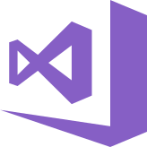

Hi there, I'm Lucas 👋  
I like C#, Typescript, Dota 2 (sometimes I hate), gym, beer, eletronic music and rock.   

 

 
 
 
 
 
 
 
 
 

### Languages and Tools:

 
 

### Connect with me:

[][linkedin]
[][spotify]
[][steam]
[][soundcloud]

 
 

[linkedin]: https://www.linkedin.com/in/lucasg-magalhaes/
[spotify]: https://open.spotify.com/user/q8sa4pbal7muopv48coaiyn9i
[steam]: https://steamcommunity.com/id/sieshow/
[soundcloud]: https://soundcloud.com/lucas-magalhaes-460948484
